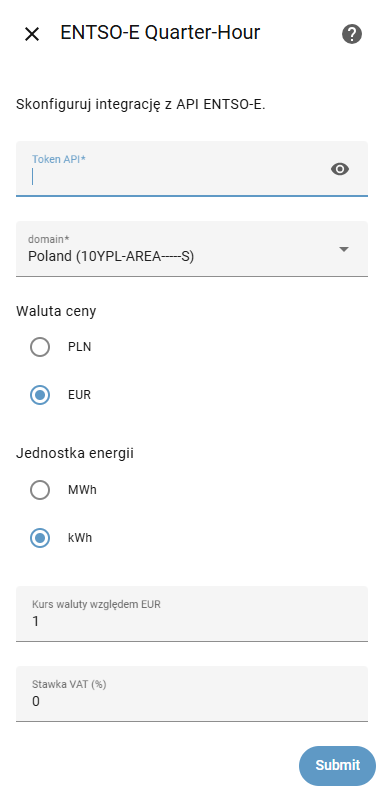

# ENTSO-E energy price integration

Home Assistant integration distributed through HACS that retrieves quarter-hour electricity prices from the ENTSO-E API.

**Current version:** 0.4.2

## Features

- Automatic download of the A44 document for the current and next day (CET/CEST) every 30 minutes.
- Support for PT15M resolution (96 points per day) and calculation of an hourly average.
- Conversion of EUR/MWh prices to the selected currency (EUR or PLN) and energy unit (kWh or MWh).
- Optional VAT markup and custom exchange rate configuration.
- Two sensors available:
  - `15-minute energy price` – current price for the ongoing 15-minute slot.
  - `Hourly energy price` – average price for the current hour (four quarter-hour points).
- Sensor attributes udostępniają lekkie serie cenowe opisane przez początek dnia (`start`), rozdzielczość (`step_minutes`) oraz listy wartości `today` i opcjonalnie `tomorrow`, zachowując pełną kompatybilność z limitami rekordu Home Assistanta.

## Installation

1. Add this repository to HACS as a custom repository.
2. Install the `ENTSO-E Energy Prices` integration.
3. In Home Assistant, go to `Settings → Devices & Services → Add Integration` and select `ENTSO-E Energy Prices`.

   
4. Provide your ENTSO-E API token (required) and configure the remaining parameters (area, currency, exchange rate, VAT).

## Configuration

| Field | Description |
| ----- | ----------- |
| API token | Required security token obtained from the ENTSO-E portal. |
| Area (country and tariff) | Select the ENTSO-E bidding zone from the dropdown list. The default is `10YPL-AREA-----S` for Poland. |
| Price currency | EUR or PLN. |
| Energy unit | kWh or MWh. |
| Exchange rate versus EUR | Required when using a currency other than EUR. |
| VAT rate (%) | Optional VAT percentage added to the calculated price. |

## Using the price series in Home Assistant

Both sensors expose a compact data model in their attributes:

- `unit_of_measurement` and `currency` describe the values.
- `start` contains the ISO 8601 timestamp for the beginning of the current dataset (midnight in the bidding zone time).
- `step_minutes` informs how many minutes elapse between consecutive points (15 or 60).
- `today` is a list of floats representing every slot of the current day, trimmed and rounded to four decimal places.
- `tomorrow` is present only when the next-day forecast is available and follows the same structure as `today`.
- `*_min`, `*_max` and `*_avg` deliver precomputed statistics for each available list.
- `updated_at`, `source`, `in_domain` and `out_domain` provide metadata about the fetch.

The sensor state itself (`current`) updates only when the rounded values change, preventing redundant recorder entries while keeping the daily schedule readily available for charts such as ApexCharts.

### Polish translation / Tłumaczenie na język polski

- `unit_of_measurement` oraz `currency` opisują jednostkę i walutę cen.
- `start` zawiera znacznik ISO 8601 początku zestawu danych (północ w strefie cenowej ENTSO-E).
- `step_minutes` określa, co ile minut pojawia się kolejna wartość (15 lub 60).
- `today` to lista liczb zmiennoprzecinkowych z bieżącego dnia, przycięta do maksymalnie 96 pozycji (lub 24 dla godzin) i zaokrąglona do czterech miejsc.
- `tomorrow` pojawia się tylko wtedy, gdy ENTSO-E udostępnia prognozę na jutro.
- `*_min`, `*_max` i `*_avg` udostępniają gotowe statystyki dla każdej z list.
- `updated_at`, `source`, `in_domain` i `out_domain` pozwalają śledzić metadane pobrania.

Stan sensora (`current`) zmienia się tylko przy istotnych różnicach w danych, dzięki czemu historia pozostaje zwięzła, a atrybuty dalej oferują kompletny harmonogram cen do wykorzystania w wykresach lub automatyzacjach.

## License

Released under the MIT License.
